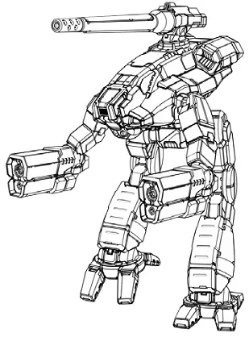
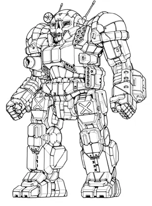
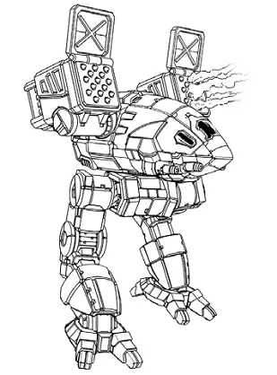
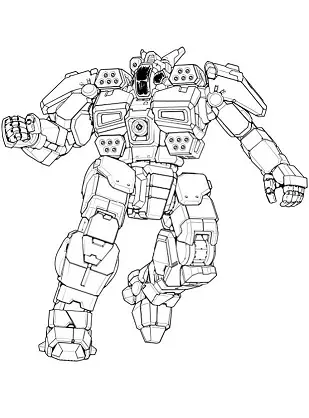
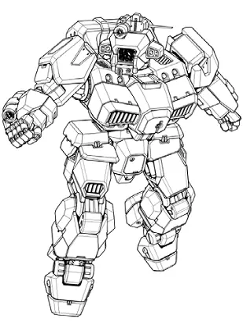

Bennet's Badgers
------------------------------------

Bennet's Badgers is a small, struggling mercenary company.

Jane Bennet

* Mech: `Marauder C <http://masterunitlist.info/Unit/Details/2032/marauder-c>`_
* Sarna: `Marauder article <https://www.sarna.net/wiki/Marauder>`_
* Piloting: 4
* Gunnery: 4
* BV: 1.882
* PV: 36

Elizabeth Bennet

* Mech: `Atlas C 2 <http://masterunitlist.info/Unit/Details/8431/atlas-c-2>`_
* Sarna: `Atlas article <https://www.sarna.net/wiki/Atlas>`_
* Piloting: 5
* Gunnery: 3
* BV: 3.283
* PV: 57

Mary Bennet

* Mech: `Catapult CPLT-C5A <http://masterunitlist.info/Unit/Details/484/catapult-cplt-c5a>`_
* Sarna: `Catapult article <https://www.sarna.net/wiki/Catapult>`_
* Piloting: 5
* Gunnery: 4
* BV: 1.772
* PV: 41

Catherine Bennet

* Mech: `Griffin IIC 2 <http://masterunitlist.info/Unit/Details/1311/griffin-iic-2>`_
* Sarna: `Griffin IIC article <https://www.sarna.net/wiki/Griffin_IIC>`_
* Piloting: 5
* Gunnery: 4
* BV: 1.516
* PV: 30

Lydia Bennet

* Mech: `Shadow Hawk IIC 3 <http://masterunitlist.info/Unit/Details/2913/shadow-hawk-iic-3>`_
* Sarna: `Shadow Hawk IIC article <https://www.sarna.net/wiki/Shadow_Hawk_IIC>`_
* Piloting: 5
* Gunnery: 4
* BV: 1.471
* PV: 33

