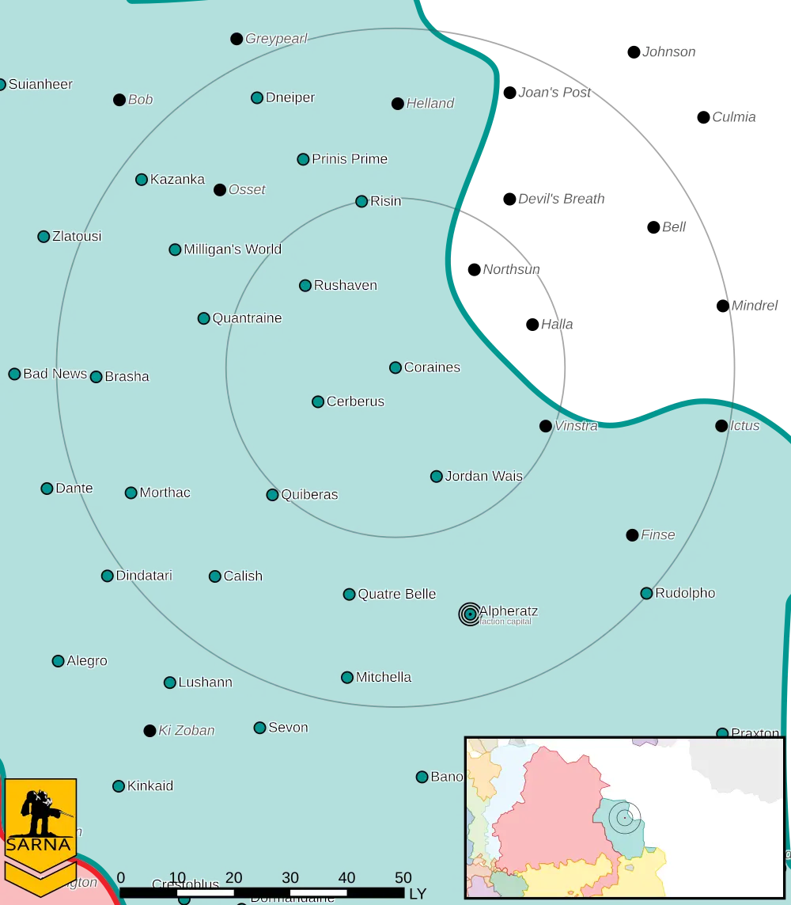

Coraines
------------------------------------

Coraines is a wealthy but minor system in the Raven Alliance.

* Planet Type: Terrestrial
* Diameter: 13,500,0 km
* Position in System: 4 (2,240 AU)
* Time to Jump Point: 16,11 days
* Year length: 3,6 Terran years
* Day length: 28,0 hours
* Surface Gravity: 1,31 g
* Atmosphere: Breathable
* Atmospheric Pressure: Standard
* Atmospheric Composition: Nitrogen and Oxygen, plus trace gasses
* Equatorial Temperature: 34C
* Surface Water: 65\%
* Highest Native Life: Fish
* Satellites: GGO.1 (medium), GGO.2 (medium), GGO.3 (medium)
* Capital City: La Celle-Dunoise
* Population: 80.480.264
* Socio-industrial Levels:
    * B: Advanced World
    * C: Basic heavy industry; about 22th century level
    * A: Fully self-sufficient raw material production
    * B: Good industrial output
    * A: Breadbasket
* HPG: B-rated
* Sarna: `Coraines article <https://www.sarna.net/wiki/Coraines>`_
