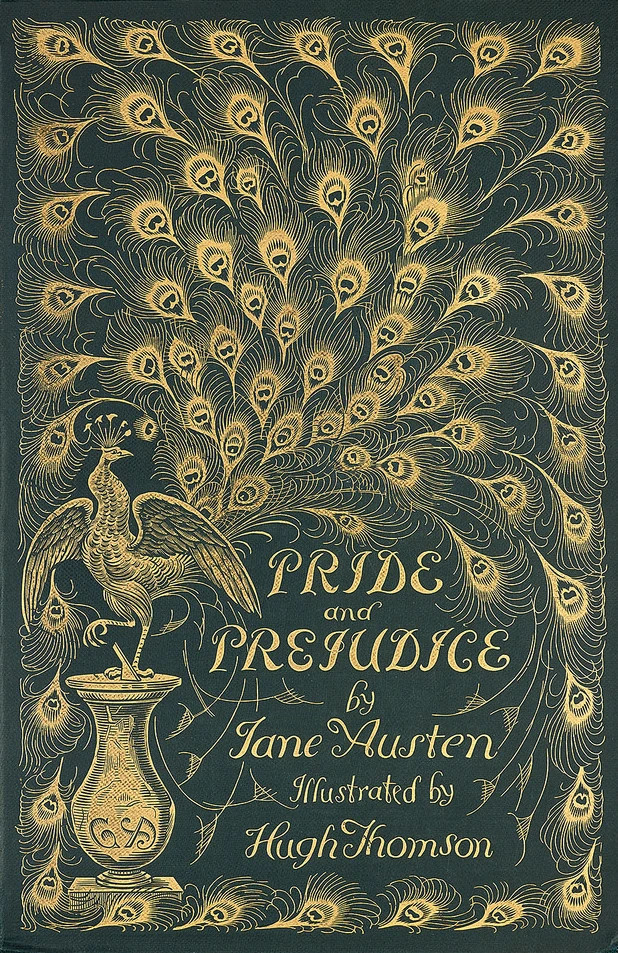

.. Mercenary's Pride main document

Mercenary's Pride
====================================

Mercenary's Pride is a retelling of `Jane Austin's <https://en.wikipedia.org/wiki/Jane_Austen>`_ popular novel `Pride and Prejudice <https://en.wikipedia.org/wiki/Pride_and_Prejudice>`_ as a series BattleTech scenarios inspired by the major events in the book.

Players follow members of Bennet's Badgers, a struggling family mercenary company, as they defend Jordan Wais from pirate raids, coordinate with local militia forces, and navigate tensions with a Clan Snow Raven star.
15 monthly scenarios offer players opportunities to play through key moments and earn points representing how closely they recreate the lore of Mercenacy's Pride.

.. toctree::
   :maxdepth: 2
   :caption: Contents:

   0-How-To-Play/index
   1-Characters/index
   2-Locations/index
   3-Scenarios/index
   license
