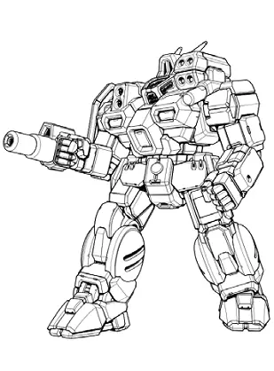

Bennet's Badgers
------------------------------------

Bennet's Badgers is a small, struggling mercenary company.

Jane Bennet

.. image:: ../img/BlackKnight.webp
  :width: 45%
  :alt: Black Knight BattleMech
  :align: center

* MUL: `Black Knight BL-12-KNT <http://masterunitlist.info/Unit/Details/356/black-knight-bl-12-knt>`_
* Sarna: `Black Knight article <https://www.sarna.net/wiki/Black_Knight>`_
* Piloting: 4
* Gunnery: 4
* BV: 2.204
* PV: 40

Elizabeth Bennet

.. image:: ../img/Atlas.webp
  :width: 45%
  :alt: Atlas BattleMech
  :align: center

* MUL: `Atlas C 2 <http://masterunitlist.info/Unit/Details/8431/atlas-c-2>`_
* Sarna: `Atlas article <https://www.sarna.net/wiki/Atlas>`_
* Piloting: 5
* Gunnery: 3
* BV: 3.283
* PV: 57

Mary Bennet

* MUL: `Conjurer <https://masterunitlist.info/Unit/Details/1473/hellhound-conjurer>`_
* Sarna: `Conjurer article <https://www.sarna.net/wiki/Conjurer_(Hellhound)>`_
* Piloting: 5
* Gunnery: 4
* BV: 1.813
* PV: 35

Catherine Bennet

* MUL: `Shadow Hawk IIC <https://masterunitlist.info/Unit/Details/2911/shadow-hawk-iic>`_
* Sarna: `Shadow Hawk IIC article <https://www.sarna.net/wiki/Shadow_Hawk_IIC>`_
* Piloting: 5
* Gunnery: 4
* BV: 1.732
* PV: 37

Lydia Bennet

.. image:: ../img/GriffinIIC.webp
  :width: 45%
  :alt: Griffin IIC BattleMech
  :align: center

* MUL: `Griffin IIC <https://masterunitlist.info/Unit/Details/1310/griffin-iic>`_
* Sarna: `Griffin IIC article <https://www.sarna.net/wiki/Griffin_IIC>`_
* Piloting: 5
* Gunnery: 4
* BV: 1.608
* PV: 31

