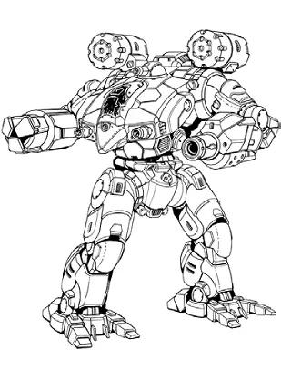
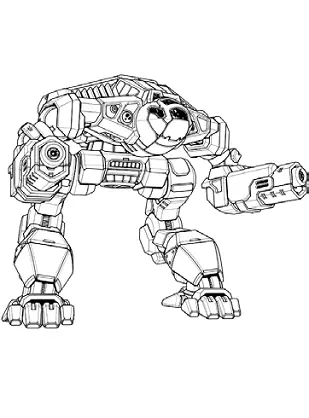
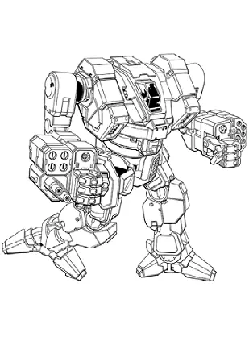

Snow Ravens
------------------------------------

Expeditionary Star Alpha is a Snow Raven star on special assignment.

Star Captain Fitzwilliam Darcy

* Mech: `War Crow B <http://masterunitlist.info/Unit/Details/7547/war-crow-b>`_
* Sarna: `War Crow article <https://www.sarna.net/wiki/War_Crow>`_
* Piloting: 5
* Gunnery: 3
* BV: 3.344
* PV: 53

Star Commander Charles Bingley

.. image:: ../img/Crossbow.webp
  :width: 45%
  :alt: Crossbow OmniMech
  :align: center

* Mech: `Crossbow G <http://masterunitlist.info/Unit/Details/8237/crossbow-g>`_
* Sarna: `Crossbow article <https://www.sarna.net/wiki/Crossbow_(OmniMech)>`_
* Piloting: 4
* Gunnery: 4
* BV: 1.898
* PV: 38

Caroline

* Mech: `Pouncer I <http://masterunitlist.info/Unit/Details/9263/pouncer-i>`_
* Sarna: `Pouncer article <https://www.sarna.net/wiki/Pouncer>`_
* Piloting: 5
* Gunnery: 4
* BV: 1.781
* PV: 31

Louisa

.. image:: ../img/Adder.webp
  :width: 45%
  :alt: Adder OmniMech
  :align: center

* Mech: `Adder I <http://masterunitlist.info/Unit/Details/7479/puma-adder-i>`_
* Sarna: `Adder article <https://www.sarna.net/wiki/Adder_(Puma)>`_
* Piloting: 5
* Gunnery: 4
* BV: 1.575
* PV: 36

Philip

* Mech: `Mist Lynx C <http://masterunitlist.info/Unit/Details/1829/koshi-mist-lynx-c>`_
* Sarna: `Mist Lynx article <https://www.sarna.net/wiki/Mist_Lynx_(Koshi)>`_
* Piloting: 5
* Gunnery: 4
* BV: 1.320
* PV: 29

