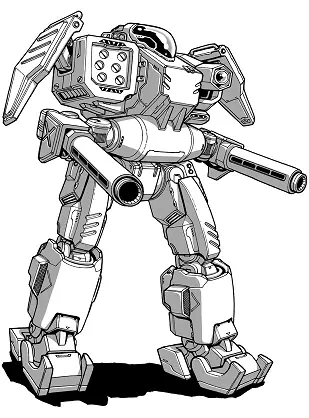

Alliance Military Corps
------------------------------------

Section Leader Forster

.. image:: ../img/Orion.webp
  :width: 45%
  :alt: Orion BattleMech
  :align: center

* Mech: `Orion ON2-M <https://masterunitlist.info/Unit/Details/2338/orion-on2-m>`_
* Sarna: `Orion article <https://www.sarna.net/wiki/Orion>`_
* Piloting: 5
* Gunnery: 4
* BV: 1.828
* PV: 43

Supervisor George Wickham

.. image:: ../img/PhoenixHawk.webp
  :width: 45%
  :alt: Phoenix Hawk BattleMech
  :align: center

* Mech: `Phoenix Hawk C <https://masterunitlist.info/Unit/Details/7752/phoenix-hawk-c>`_
* Sarna: `Phoenix Hawk article <https://www.sarna.net/wiki/Phoenix_Hawk>`_
* Piloting: 6
* Gunnery: 3
* BV: 1.619
* PV: 31

Supervisor Carter

* Mech: `Dark Crow <https://masterunitlist.info/Unit/Details/827/dark-crow>`_
* Sarna: `Dark Crow article <https://www.sarna.net/wiki/Dark_Crow>`_
* Piloting: 5
* Gunnery: 4
* BV: 1.594
* PV: 35

Guardian Chamberlayne

.. image:: ../img/Locust.webp
  :width: 45%
  :alt: Locust BattleMech
  :align: center

* Mech: `Locust C <https://masterunitlist.info/Unit/Details/7601/locust-c>`_
* Sarna: `Locust article <https://www.sarna.net/wiki/Locust>`_
* Piloting: 5
* Gunnery: 4
* BV: 672
* PV: 23

Guardian Denny

* Mech: `Stinger C <https://masterunitlist.info/Unit/Details/8127/stinger-c>`_
* Sarna: `Stinger article <https://www.sarna.net/wiki/Stinger>`_
* Piloting: 5
* Gunnery: 4
* BV: 592
* PV: 18

Guardian Pratt

* Mech: `Wasp WSP-3A <https://masterunitlist.info/Unit/Details/3526/wasp-wsp-3a>`_
* Sarna: `Wasp article <https://www.sarna.net/wiki/Wasp>`_
* Piloting: 5
* Gunnery: 4
* BV: 401
* PV: 16

