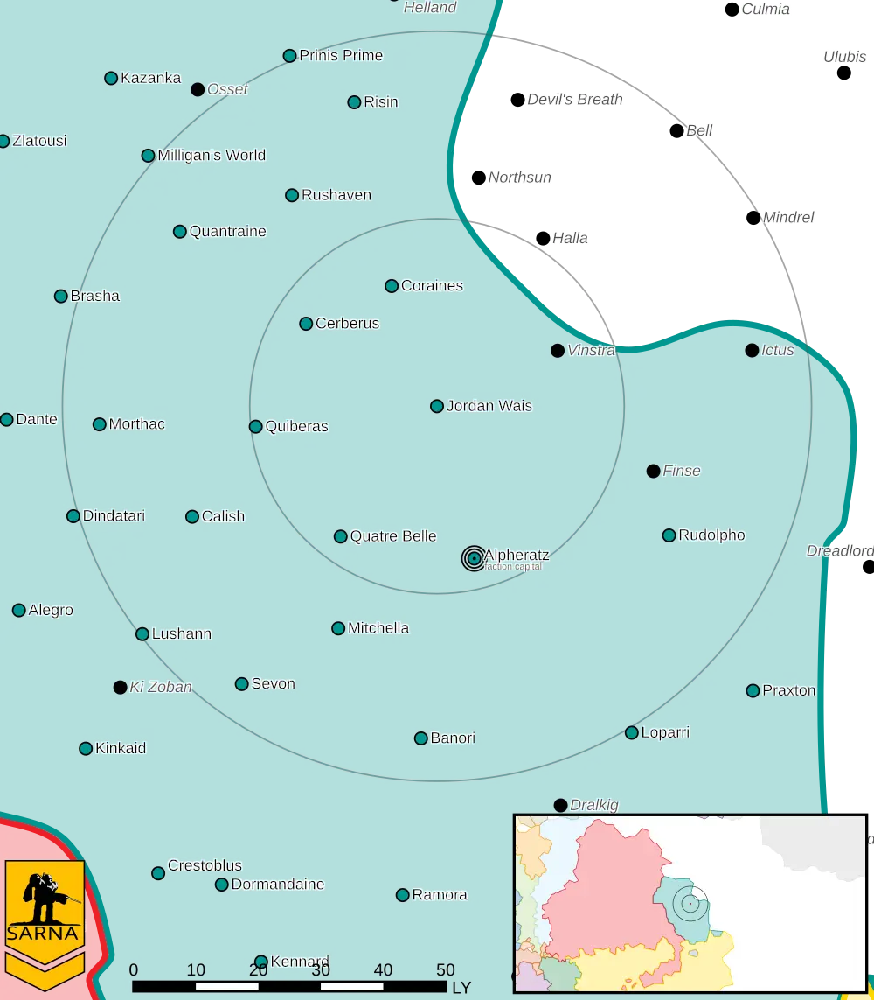

Jordan Wais
------------------------------------

Jordan Wais is a relatively quiet core world of the Raven Alliance.

* Planet Type: Terrestrial
* Diameter: 11.700,0 km
* Position in System: 2 (0,630 AU)
* Time to Jump Point: 7,03 days
* Year length: 1,1 Terran years
* Day length: 27,0 hours
* Surface Gravity: 1,14 g
* Atmosphere: Breathable
* Atmospheric Pressure: Thin
* Atmospheric Composition: Nitrogen and Oxygen, plus trace gasses
* Equatorial Temperature: 38C
* Surface Water: 27\%
* Highest Native Life: Reptiles
* Capital City: Schmidttown
* Population: 108.878.071
* Socio-industrial Levels:
    * C: Moderately advanced World
    * D: Low industrialization; about 20th century level
    * A: Fully self-sufficient raw material production
    * C: Limited industrial output
    * D: Poor agriculture
* HPG: None
* Sarna: `Jordan Wais article <https://www.sarna.net/wiki/Jordan_Wais>`_
