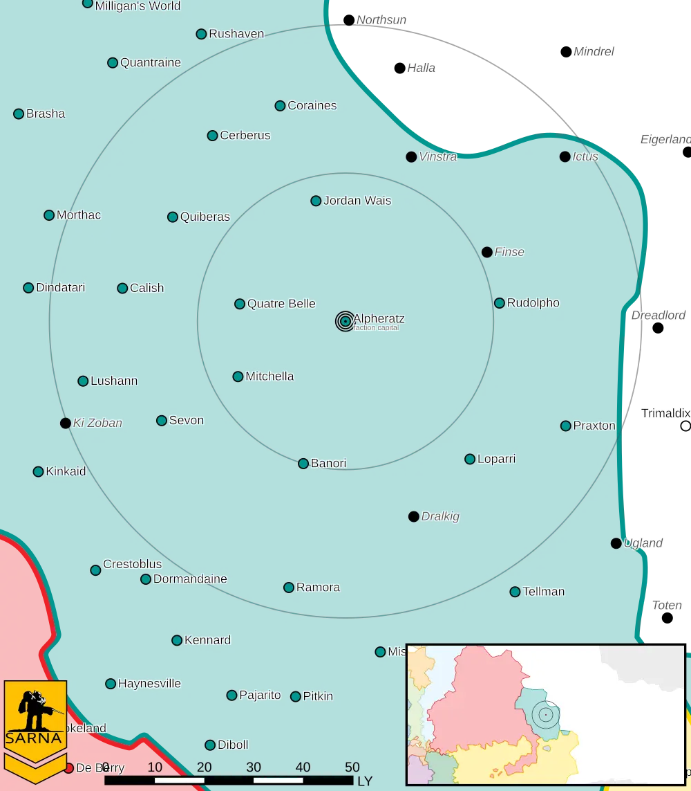

Alpheratz
------------------------------------

Alpheratz is the capital of the Raven Alliance.
Alpheratz IV is home to the Alliance Executive Parliament and has the largest military manufacturing capabilities in the Alliance, including Mountain Wolf BattleMechs.

* Planet Type: Terrestrial
* Diameter: 15.098,3 km
* Position in System: 4 (0,280 AU)
* Time to Jump Point: 4,12 days
* Year length: 0,8 Terran years
* Day length: 19,0 hours
* Surface Gravity: 1,0 g
* Atmosphere: Breathable
* Atmospheric Pressure: Standard
* Atmospheric Composition: Nitrogen and Oxygen, plus trace gasses
* Equatorial Temperature: 30C
* Surface Water: 70\%
* Highest Native Life: Mammals
* Satellites: Aisha (large)
* Capital City: Mackennopolis
* Population: 3.432.480
* Socio-industrial Levels:
    * B: Advanced World
    * A: Heavily industrialized
    * B: Mostly self-sufficient raw material production
    * A: High industrial output
    * B Agriculturally abundant world
* HPG: None
* Sarna: `Alpheratz article <https://www.sarna.net/wiki/Alpheratz>`_
